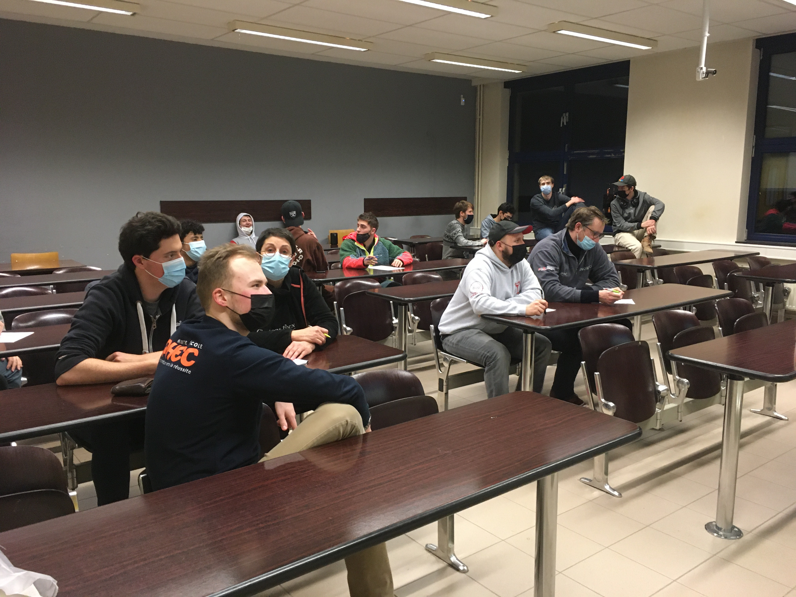
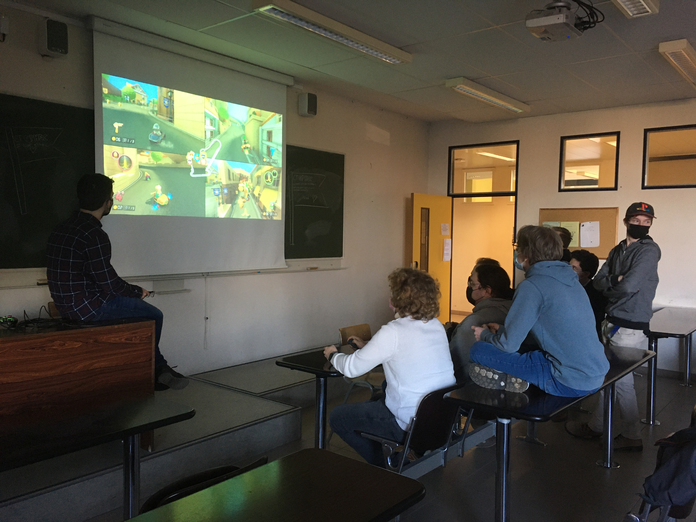
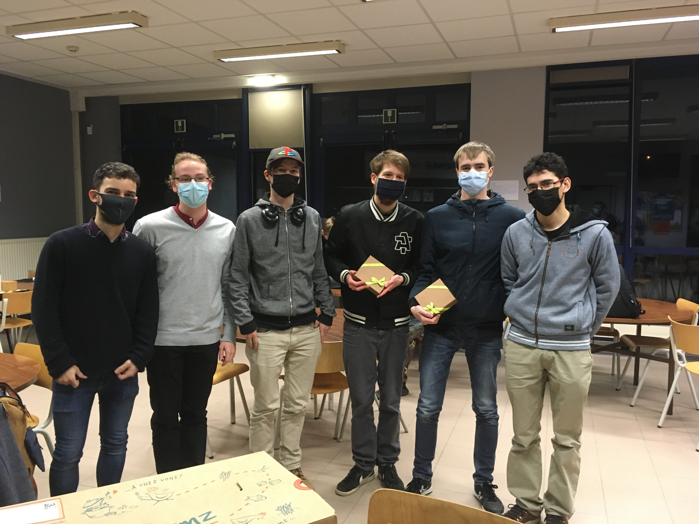

# Capture the flag - 2022
---

> In 2022, I participated in the Capture the Flag event organized by some third year students for their final year project. 
> This event took place in the school's computer lab and lasted for 15 hours and 30 minutes. 
> The goal was to solve a series of challenges in the different fields learned in the course. 
> It could be cryptography, web security, reverse engineering, .ect  
> And when we solved it we got a flag that we had to submit to the platform to get points. 
> This was the first time I participated in such an event and I enjoyed it a lot. 
> I was in my first year and the competition was open to all years, so it was not easy at all! 
> But we were a team of 4 with people in all years of study, so I could learn and see what I was going to see in the course. 
> I learned a lot of tools, website and techniques that I would use for later classes. 
> It is also at this event that I make great bond with some of my best friends today. 
> In the end we did not win but we were not last either. 
> After the different events I did in the three years of my courses, I can say that the CTF is my favorite type of event. 

## Picture when we were introduced to the event
---

## Picture of a little break in the competition
---

## Picture of the team at the end of the event

(The two people on the left were the organizers of the event)
