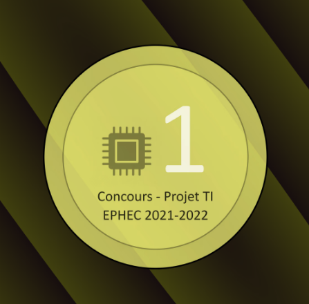
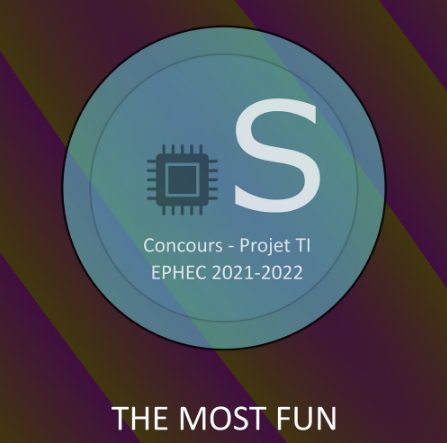

# IT Competition - 2022
---

> In 2022, I participated in the IT competition organized by the school. 
> The goal of the competition was to create an electronic project in a day. 
> This was my first introduction to electronic and microcontroller programming. 
> I was already really interested in little electronics and making little device for fun purpose like drones or self-made domotics. 
> So I was really excited to participate in this competition. 
> I was with a friend of mine, and we decided to make a Simon game where you had to remember a series of color in order 
> and repeat it with multiple buttons on a breadboard. 
> We had to use an Arduino board, some LED and buttons to make it work. 
> It was the most fun project I did in the school, and we were really proud of the result. 
> We succeeded to make it work, and **win the first place**! 
> Not only that, but we also won the "Funnier project" trophies  
> A funny things is that the trophies were NFT made by the school and so I also got my first NFT that time! 
> I learned a lot from my friends who were already better in electronics than me, and discover my passions for little electronics project like that. 
> Now I try to tackle more complex projects like making robot and tracking device. 

## [First place trophy](https://opensea.io/assets/matic/0x2953399124f0cbb46d2cbacd8a89cf0599974963/21732013791090266363568720756357880640486582999361484950763526311892326809604/)

## [Funnier project trophy](https://opensea.io/assets/matic/0x2953399124f0cbb46d2cbacd8a89cf0599974963/21732013791090266363568720756357880640486582999361484950763526312991838437380)

