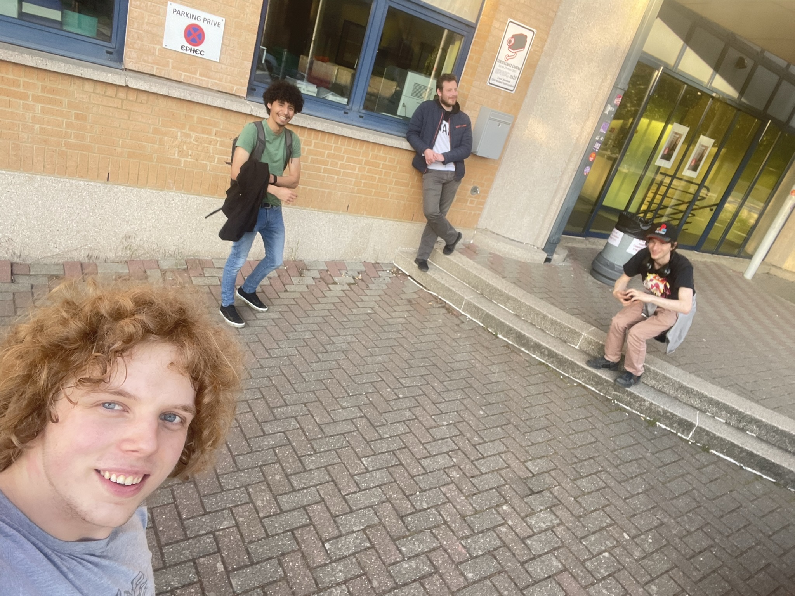

# Organisation of the first Ephec LAN - 2022
---

> That year, the school just transform one of the room into a place for IT students to work, relax and chat called the "OpenLab". 
> With that room repurposed, a team of student bring the idea to make a LAN party in the school. 
> But one and a half week before the event, the team had abandoned the project, so the teacher in charge ask if someone would take back the project. 
> So with two friends in my class we proposed to take the LAN back, and they accepted it. 
> So we had to make the LAN infrastructure work on the school network, and make the room ready for the event in nearly one week. 
> The network was the hardest part, because the room and inner network was not really planned for that. 
> We used the knowledge we just had in our network and system administration class to make it work,  
> and succeeded at the task after a little help from the teacher. We had to search and find a lot on how to host game servers and took time too. 
> We planned all the day with different games and tournaments, with activities between match. 
> We also planned to have 3d printed trophies I would have printed at home, but where too short on time to get a model and print it. 
> Luckily, everything went smooth on the LAN day, the server we had to create to host the games works well. 
> We had a lot of fun and the people who came were really happy of the event, even if it was a little bit rushed. 

## Picture of the team and our teacher
---

## Picture of the room during the event
---

## Picture of the team working on setting the network and servers 
---

