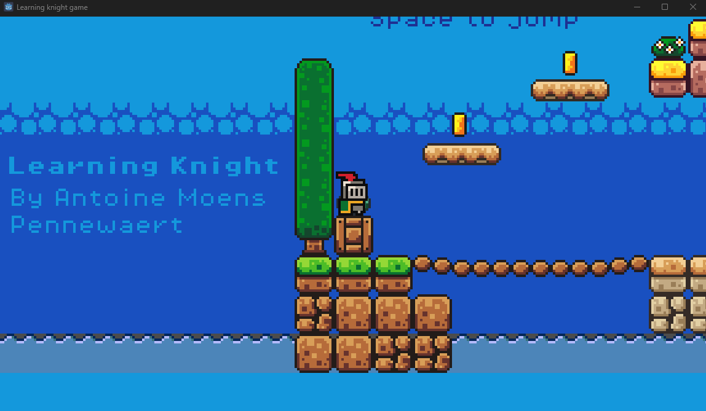

# Learning Knight Game
---

> I always wanted to try out game development and nearly took that path when deciding what to reorient to after my first year in physics. 
> So I decided to start learning game development on my own and see if I could make a game with the proclamation skills I develop after the last 3 years. 
> I know C# is the main language for the top engine like Unity or Unreal. 
> But I was comfortable with python, so I look up to code game with it and found out about the Godot engine. 
> An open source engine that uses GDScript, a python-like language. 
> I started to follow a well-known teacher in the community on YouTube that just started a series on game development with Godot, so I jump on the occasion! 
> This game is the game I made following the formation, but expending on some personal feature not yet implemented. 
> The game right now is very simple, it doesn't even have an end for now, but it is a backbone for me to learn game development, so I can begin making my own one in the future. 
> This is a perfect example of project that motivates me because it is very visual and interactive, 
> so I can see the result of my work directly and be proud of every little advancements. 

## Here is the link to the game :   [Learning Knight Game](https://github.com/Fire-Aspect/Learning-knight-game/tree/v0.1.0-alpha)

### (You need to go the release section on the repository, and download the .exe file to play.)

