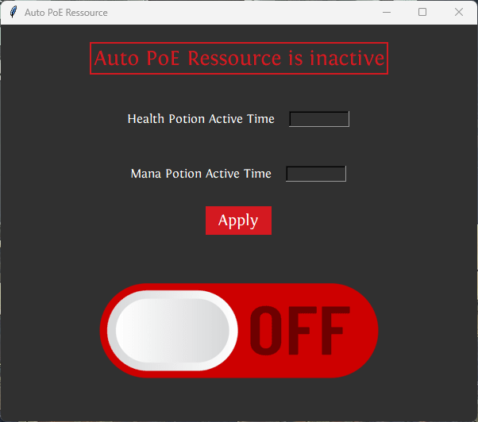

# Vie et Mana
---

> This is project I did for fun to challenge myself in the new knowledge I got in signal processing, computer vision and python programming. 
> I was just playing a game called Path Of Exile where you have a health and mana bar that you can fill up with potions. 
> But I found out I was terrible at managing my health and mana, so I took the occasion to test myself and see if I could make a project of myself. 
> The program was pretty simple in concept, it would take screenshot at a decent rate and analyze the color of the one pixel in the health and mana bar. 
> Then if the rgb code was not the color of the ressource, it would press the keybind to use the potion. 
> At first I try to make it works with the mana, and succeeded, it was awesome to see a creation work! 
> After, I make it works with the health. And saw that it would be a problem if it runs all the time. 
> So I made a standalone interface where you could start and stop the program, and put some other parameters. 
> And with that I applied a lot of different knowledge I got in the last year, like threading, GUI, image processing, and message queue. 
> As I did this in 2023 I now spot a lot of things I could have done better on the programming, which is good things because it shows I improved. 

## Here is the link to the repository :   [Vie et Mana](https://github.com/Fire-Aspect/Vie-et-Mana)

## Here is a picture of the interface :
